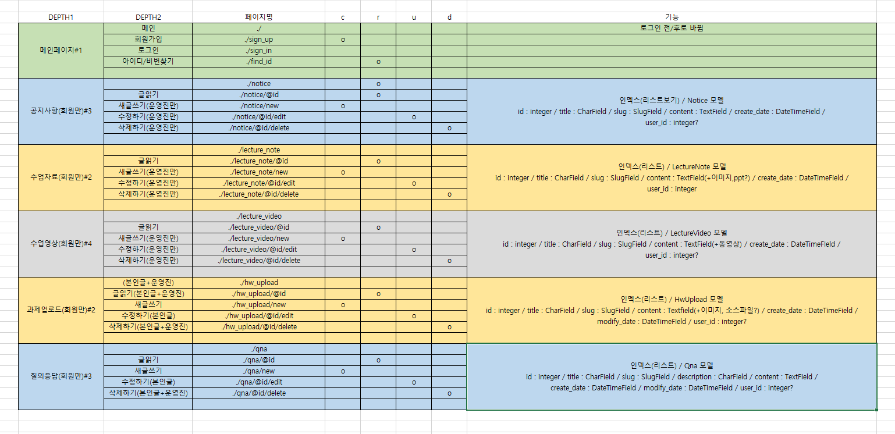

# honG
 
</img>  

 <h1>오픈소스SW G조 레파지토리</h1> 
 <h3>오픈소스인 python django 웹 프레임워크를 이용한 Dynamic Webpage 입니다.</h3> 
 
교내에 운영중인 전국 연합 동아리 <strong>'멋쟁이 사자처럼'</strong> 을 소개하고 부원들이 사용할 수 있는 커뮤니티 및 정보교환, 의사소통의 장으로 활용하기 위한 웹페이지를 제작합니다. 
 웹페이지는 크게 공지사항 게시를 위한 게시판, 운영진이 수업을 진행하는데 사용했던 수업 자료 게시를 위한 게시판, 수업 진행 녹화물, 부원들이 주어진 과제를 완료하고 제출할 수 있는 게시판, 여러 궁금한 점 등을 서로 공유하고 자유롭게 질의응답할 수 있는 게시판, 동아리 내에서 본인이 원하는 공부를 함께할 스터디 멤버를 모집할 수 있는 게시판 등을 제공합니다.
 
 

 -공지사항 게시판은 간단하게 CRUD를 포함하고 모든 게시판에서 볼 수 있고 열람 가능한 형태입니다. 관리자는 모든 권한을 가지고, 운영진은 삭제를 제외한 모든 권한을 가지며, 일반 부원은 열람만 가능합니다.  
 </img>
 -수업자료 게시판은 운영진이 수업을 진행할 때 사용했던 프레젠테이션 파일, 영상 파일 등을 업로드할 수 있는 기능을 포함하며 기본적인 CRUD를 제공하고 운영진은 모든 권한이 가능하며, 일반 부원은 열람만 가능한 형태입니다.  
 </img>
 -과제업로드 게시판은 주어진 과제를 제출할 수 있게끔 파일 업로드 기능을 포함하며(소스파일, 이미지 파일 등) 기본적인 CRUD를 포함합니다. 관리자는 모든 권한을 가지고, 운영진은 열람만 가능하며, 일반 부원은 본인의 게시물만 보여지고 수정가능하며 삭제가능합니다. 
 </img>
 -질의응답 게시판은 기본적인 CRUD와 이미지 업로드 기능 정도만 포함합니다. 관리자와 운영진은 모든 권한이 주어지며, 일반부원은 열람 외에는 본인의 게시물만 수정,삭제 등이 가능합니다. 
 </img>

<h2>Development environment</h2> 
**python 3.6.2** 
**django 2.1.2** 

